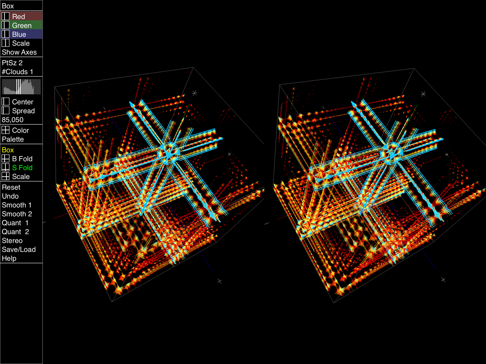

# MandelBulb2
MandelBulb, MandelBox and Julia sets for iPad using Swift and Metal.

Uses the point cloud method to render various MandelBulb equations \
and a rendition of the MandelBox. \
Also stacks a collection of Julia set drawings to produce a 3D cloud. \
Recently added: Quaternion Julia Set and Octahedra IFS.

Uses my new favorite UX control panel, which makes the programmer's job easier, \
and leaves most of the screen real estate for drawings.

